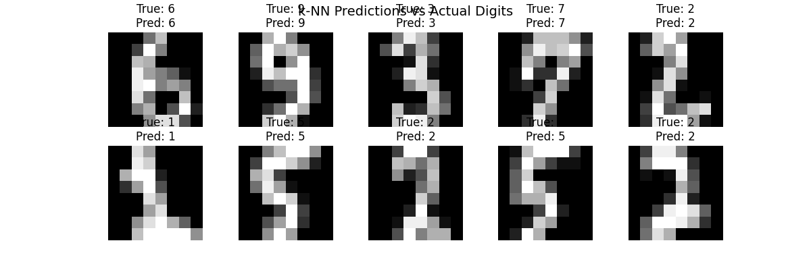

# 🖊️ Handwritten Digits Classification (k-NN)

A beginner-friendly **Machine Learning project** that implements the **k-Nearest Neighbors (k-NN)** algorithm from scratch in Python,  
and compares it with scikit-learn’s implementation on the classic **Digits dataset (8x8 grayscale images of handwritten digits 0–9).**

The model is trained on the Digits dataset (8x8 grayscale images of handwritten digits 0–9).

---

# Features
- k-NN implemented from scratch (no external ML libraries).
- Comparison with scikit-learn’s `KNeighborsClassifier`.
- Visualization of predictions vs actual digits.
- Accuracy evaluation on test data.

---

# Project Structure
├── main.py          # Main Python script  
├── requirements.txt # Dependencies  
├── results.png      # Sample visualization of predictions  
└── README.md        # Project description  

---

# Results
Here’s an example of the model’s predictions:



---

## 🛠️ How to Run

1. Clone the repository:
   ```bash
   git clone https://github.com/your-username/handwritten-digits-knn.git
   cd handwritten-digits-knn
2. Install dependencies:
   ```bash
pip install -r requirements.txt
3. Run the project:
    ```bash
python main.py

---

## 🚀 Future Improvements

1. Experiment with different values of *k* to compare performance.  
2. Try other distance metrics (e.g., Manhattan, Cosine).  
3. Extend the project to use other datasets (like MNIST).  
4. Optimize performance for larger datasets.  
5. Add a simple web app or GUI to make predictions interactively.

